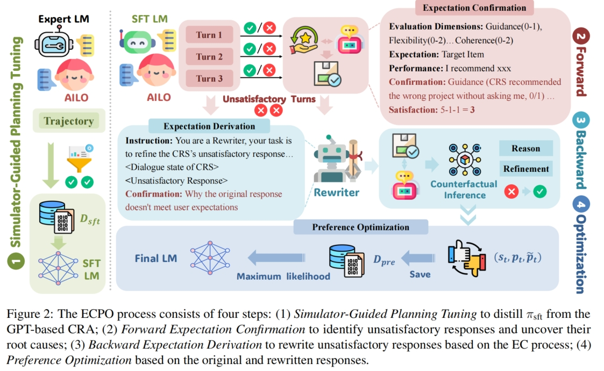
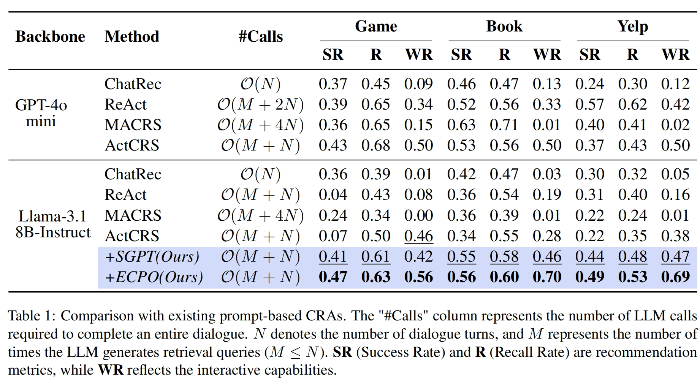
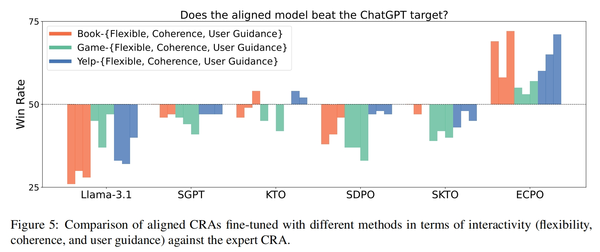

# **ECPO**
This repository is based on our paper: Expectation Confirmation Preference Optimization for Multi-Turn Conversational Recommendation Agent.

<div  align="center">    

</div>

## Overview
- The Code for different datasets is in `hotpotqa/`, `strategyqa/`, and `intercode/`.
  - start training by `scripts/run.sh`
  - local test environment is in `test_data/`
- Human-Agent Collaboration Dataset in `dataset/`

## Usage
### Getting Start
You can use following scripts to install related python package through pip:
```
git clone https://github.com/XueyangFeng/ECPO.git
cd ECPO
pip install -r requirements.txt
```

### AILO Environment Construction

We provide detailed AILO's pipeline code and additional [readme files](./user_simulator/readme.md). For a quick start, you can download the [index file](https://drive.google.com/file/d/1P6QkUrikHnwxNov0fUY3SxWQkl1qve0O/view?usp=drive_link) and unzip it in the ```user_simulator/embedding/``` folder. 

### API Config Settings

In this article, all LLM calls are made through OpenAI-like interfaces. Please set your API information in config/api_config.json. For closed-source models, please set it directly. For open-source models, please use vllm for local deployment, we provide a example script in ```model/```. 

### Run

For existing prompt-based CRAs, you can set the relevant config directly in main.sh and run it.

Our CRA alignment consist of 4 stages: SGPT (Stage 1), ECPO (Stage 2-4)
- [Simulator-Guided Planning Tuning](backward/book/sft)
- [Forward Expectation Confirmation](forward/)
- [Backward Expectation Derivation](backward/book/ecpo)
- [Preference Optimization](LLaMA-Factory/ecpo)


## Results
The Comparison with existing prompt-based CRAs
<div  align="center">    

</div>

The Comparison of aligned CRAs fine-tuned with different methods in terms of interactivity:
<div  align="center">    

</div>

We provide original evaluation:
under `results/book`, `results/game`, and `results/yelp`.

