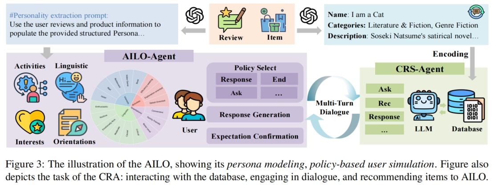

# **AILO-Pipeline**

    

If you don’t need additional data processing, we have already provided the processed dataset in the [`task`](./task) folder for direct use.  
If you have any questions about the task construction process, please refer to the following detailed workflow.

---

## **📌 1. Data Preprocessing**  

In this stage, we extract **user personas** from real review datasets (Amazon, Yelp) and filter out items they have interacted with.  
We provide the processed dataset in [`./raw_data`](./raw_data).  
If you prefer to build your dataset from scratch, you can download the original datasets and use our extraction scripts.

### **🔹 Data Processing Workflow**
1. **User & Item Sampling**  
   - Run [`preprocess.py`](./preprocess.py) to sample users and match them with their interacted items.

2. **Item Summarization**  
   - Run [`abstract.py`](./abstract.py) to generate item summaries using LLM to prevent excessive and irrelevant information.

3. **Extracting User-Interacted Items**  
   - Run [`item_extract.py`](./item_extract.py) to extract items users have interacted with and merge them into JSONL files:
     - **Target Items** (Rating ≥ 4.0): [`high_rating_item.jsonl`](./high_rating_item.jsonl)  
     - **All Interacted Items**: [`item.jsonl`](./item.jsonl) (for database construction)

---

## **📌 2. Database Construction**  

We selected **100 users, each interacting with approximately 30 items**, totaling around 3,000 items to build the recommendation task database.  
The database is encoded using **[ALL-MiniLM-L6](https://huggingface.co/sentence-transformers/all-MiniLM-L6-v2)** and indexed for external retrieval.

### **🔹 Database Construction Workflow**
1. **Data Deduplication**  
   - Run [`dup.py`](./embedding/dup.py) to remove duplicate items.

2. **Item Encoding & Indexing**  
   - Run [`embedding.ipynb`](./embedding/embedding.ipynb) to encode items and build the index.

💡 **Note**: If you do not want to build the database yourself, we provide a **[prebuilt index database](xxxurl)** for direct download and use.

---

## **📌 3. AILO Persona Construction**  

In this stage, we extract user personas from their interaction records using LLM and refine them to better suit **conversational recommendations**.

### **🔹 Persona Construction Workflow**
1. **Extracting User Persona**  
   - Run [`persona_produce.py`](./persona_produce.py) to extract users' potential attributes from [`processed_data_with_summaries.jsonl`](./processed_data_with_summaries.jsonl).

2. **Persona Refinement**  
   - Run [`persona_rewrite.py`](./persona_rewrite.py) to **enhance personas for a more natural conversational recommendation experience**.

3. **Splitting Training & Testing Sets**  
   - Run [`split.py`](./split.py) to generate the final training and testing datasets.

---

## **📌 Task Datasets**  

💾 **The final task dataset is available in the [`task`](./task) directory for direct use.**  

- **Persona Data** (Refined): [`personas_crs_yelp.jsonl`](./personas_crs_yelp.jsonl)  
- **High-Rating Items Data**: [`high_rating_item.jsonl`](./high_rating_item.jsonl)  
- **Final Training & Testing Sets**:
  - **Training Set**: [`Yelp_train.jsonl`](./Yelp_train.jsonl)  
  - **Testing Set**: [`Yelp_test.jsonl`](./Yelp_test.jsonl)  

## 
